# SQL-Project-ecommerce-frauds

## Introdução
Nesta análise exploratória de dados, investigaremos as transações de um e-commerce com o objetivo de identificar padrões e indicativos de fraudes. Utilizando VSCode, MySQL e o Microsoft Excel, nosso foco será entender melhor o comportamento das transações e detectar possíveis indicativos de atividades fraudulentas. Essa análise será fundamental para desenvolvermos estratégias eficazes de prevenção e detecção de fraudes, garantindo a segurança e a confiabilidade das operações do e-commerce.

Vamos iniciar nossa análise exploratória e investigar os dados em busca de insights valiosos para aprimorar a segurança das transações online.

## Dados e ferramentas utilizadas
O banco de dados está disponível no Kaggle, e pode ser acessado no link abaixo:

https://www.kaggle.com/datasets/vbinh002/fraud-ecommerce/data

Para essa análise, usei o MySQL para importar o arquivo contendo a base de dados desse estudo, o VSCode para realizar a análise exploratória dos dados e o Microsoft Excel para a estatística descritiva e a construção dos gráficos.

## Descrição do banco de dados
Segue abaixo a descrição das variáveis:

- user_id: número de identificação do usuário
- signup_time: data e horário em que o usuário fez o login
- purchase_time: data e horário em que o usuário fez a compra
- purchase_value: valor da compra
- device_id: número de identificação do aparelho utilizado pelo cliente
- source: via por onde o usuário chegou ao e-commerce
- browser: navegador utilizado pelo usuário
- sex: gênero do usuário
- age: idade do usuário
- ip_address: endereço de IP do usuário

## Perguntas de negócio
### 1) Qual o número total de vendas? Qual a porcentagem de fraudes?

O número total de vendas do e-commerce no período analisado foi de 151112 vendas. Dessas vendas, 14151 foram fraudes, correspondendo a 9,36% do total de vendas do e-commerce. Para facilitar a interpretação dos dados, podemos analisar o gráfico abaixo.

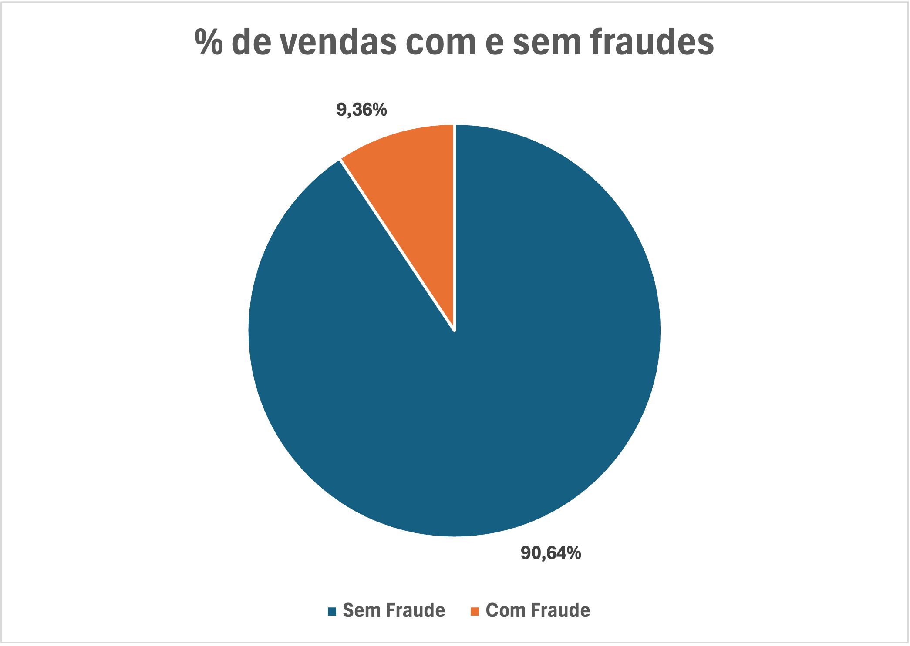

### 2) Qual foi o valor total de vendas? Qual a porcentagem de fraudes?

No período analisado, o valor total de vendas foi de $ 5581378. Desse total, $ 523488 foram fraudes, correspondendo a 9,38% do faturamento do e-commerce.

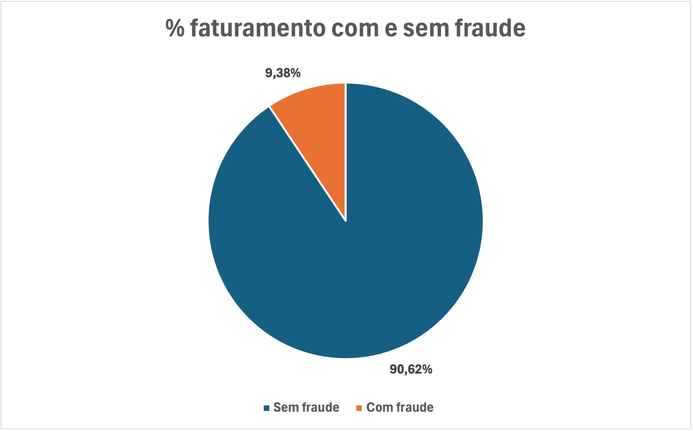

### 3) Temos algum usuário que fraudou mais de uma vez? Quem fraudou usou o mesmo dispositivo para cometer a fraude?

Procurando pelo 'user_id', não encontramos nenhum usuário que fraudou a empresa mais que uma vez. Isso pode acontecer devido a
ao fato de que o usuário que vai fraudar a empresa cria um novo usuário toda vez que faz o login.  Já utilizando o 'device_id' na busca, encontramos várias fraudes cometidas em um mesmo dispositivo, ou seja, o fraudador usa o mesmo dispositivo mais de uma vez para fraudar a empresa. 

Logo, podemos sugerir ao e-commerce barrar a compra a partir do 'device_id' para evitar mais fraudes.

Analisando os dados relacionados ao dispositivo utilizado pelo usuário, observamos que pouco mais de 50% das fraudes foram cometidas até 8 vezes no mesmo dispositivo. Especificamente, 27,49% das fraudes foram cometidas exatamente 2 vezes com um único dispositivo. A média de fraudes por dispositivo é de 7,86, com o máximo de 19 fraudes cometidas pelo mesmo dispositivo.

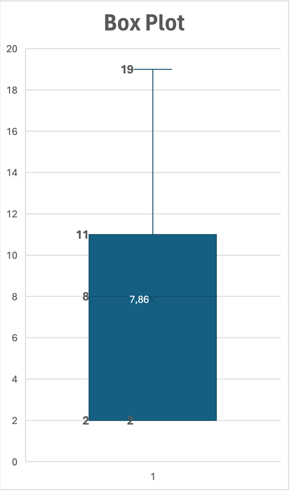

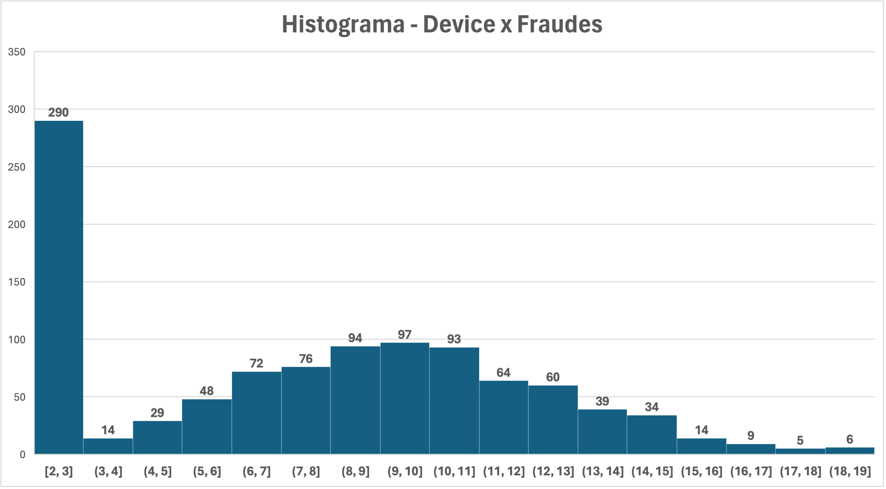

### 4) Qual o intervalo de tempo entre o cadastro e a compra do site? Existe alguma relação do intervalo de tempo com as fraudes?

Podemos observar que na maioria dos casos fraudulentos, a diferença de data é 0 dias (53,92%). A média geral é de 28,05 dias e o valor máximo é de 120 dias.

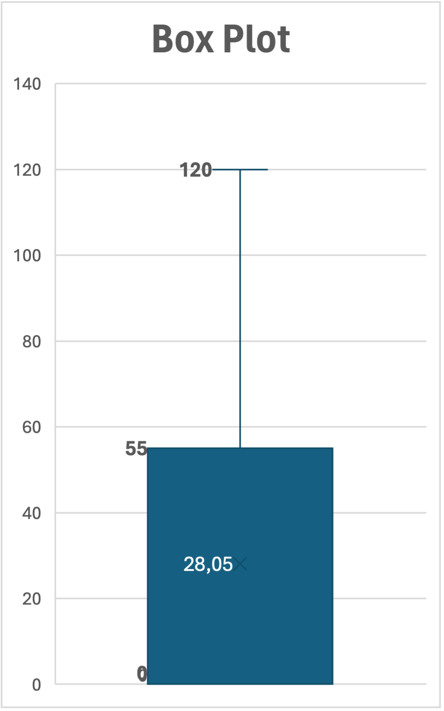
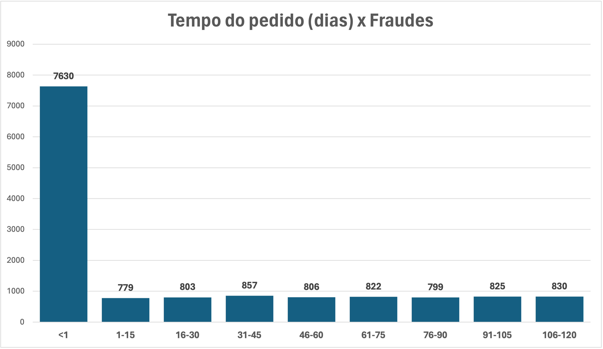

Analisando o tempo entre o login e o site em segundos, a maioria (53,71%) dos casos fraudulentos tiveram apenas 1 segundo entre o cadastro e a compra, logo, podemos sugerir ao e-commerce que esse tipo de transação também seja barrado para evitar mais problemas com fraudes.

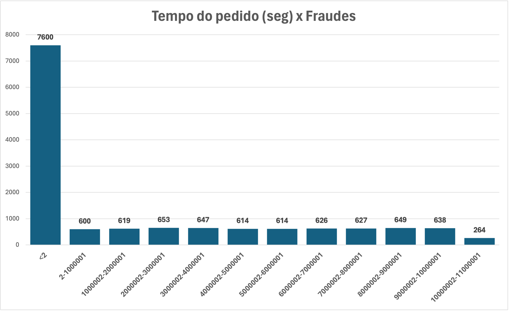

### 5 - Qual o browser teve mais fraudes?

O browser que teve mais ações fraudulentas foi o Chrome (42,89%).

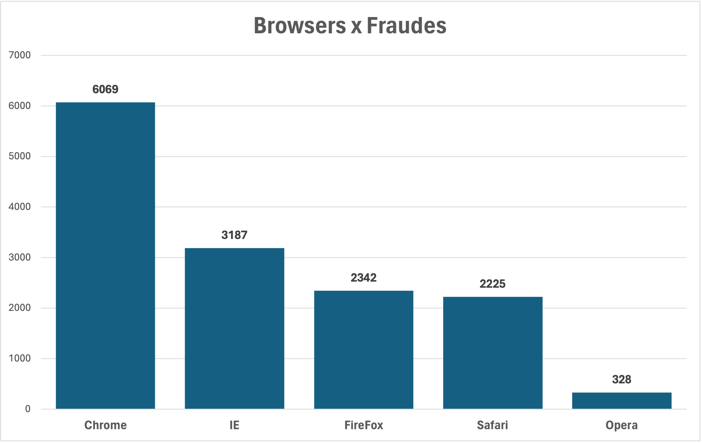

### 6 - Qual fonte teve mais fraudes?

A via que o usuário chegou ao e-commerce com mais ações fraudulentas foi Ads.

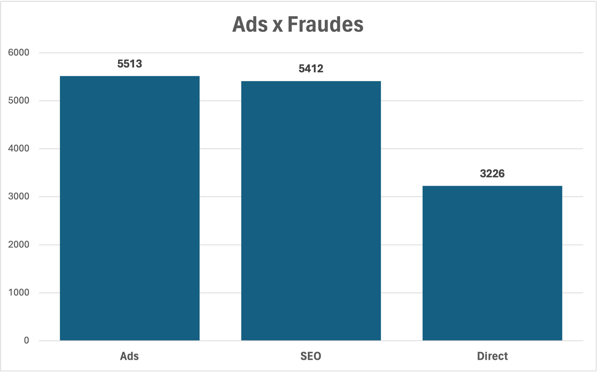

### 7 - Quem comete mais fraudes: homens ou mulheres?

Segundo os dados, homens cometem mais fraudes que mulheres. Ao todo, quase 60% das fraudes foram cometidas por homens.

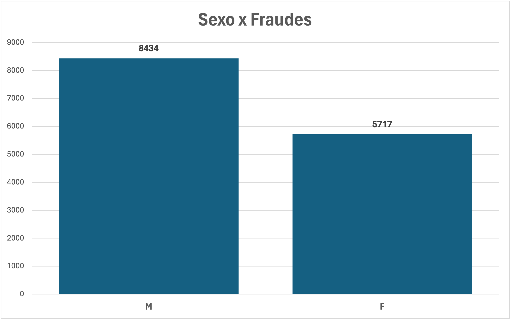

### 8 - Quais faixas etárias estão associadas às pessoas que mais cometeram fraudes?

Pessoas com 36 e 32 anos de idade foram as que mais cometeram ações fraudulentas no e-commerce em questão. Em relação as faixas etárias, pessoas entre 28-32 anos e pessoas entre 33-37 anos foram as que cometeram mais fraudes (43,23% das fraudes).

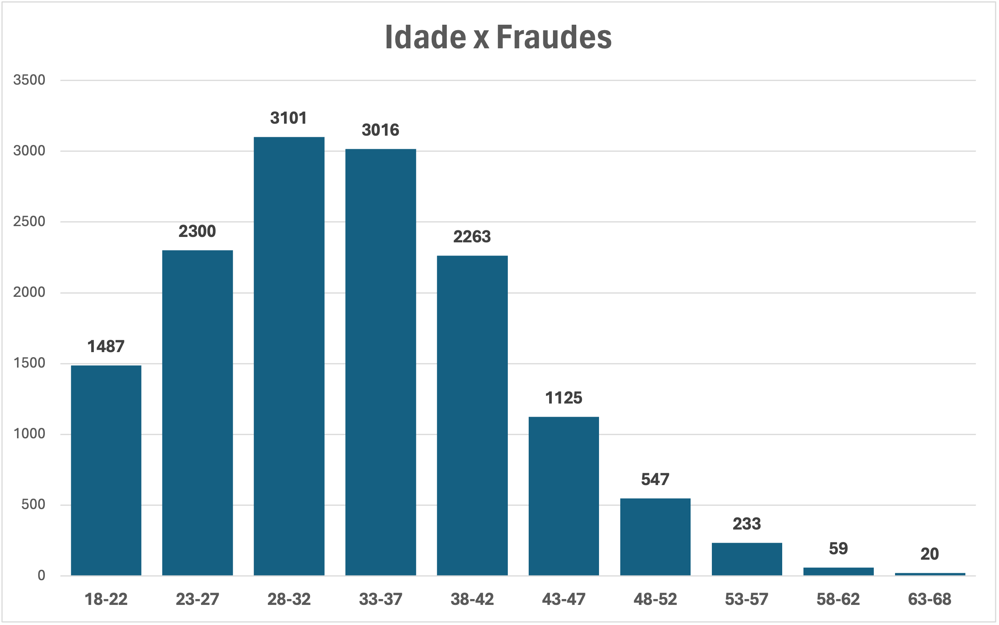

### 9 - Existe alguma faixa de preço que tem mais fraudes?

Produtos com mais ações fraudulentas custam $32, $19, $28, $23 e $17 respectivamente. Produtos na faixa de preço entre $19 e $38 foram os mais visados nas ações fraudulentas (39,09%) . Nesse caso, podemos mostrar quais produtos são mais visados pelos usuários que cometem fraudes de acordo com o seu preço para que o e-commerce tome ações preventivas em relação as fraudes.

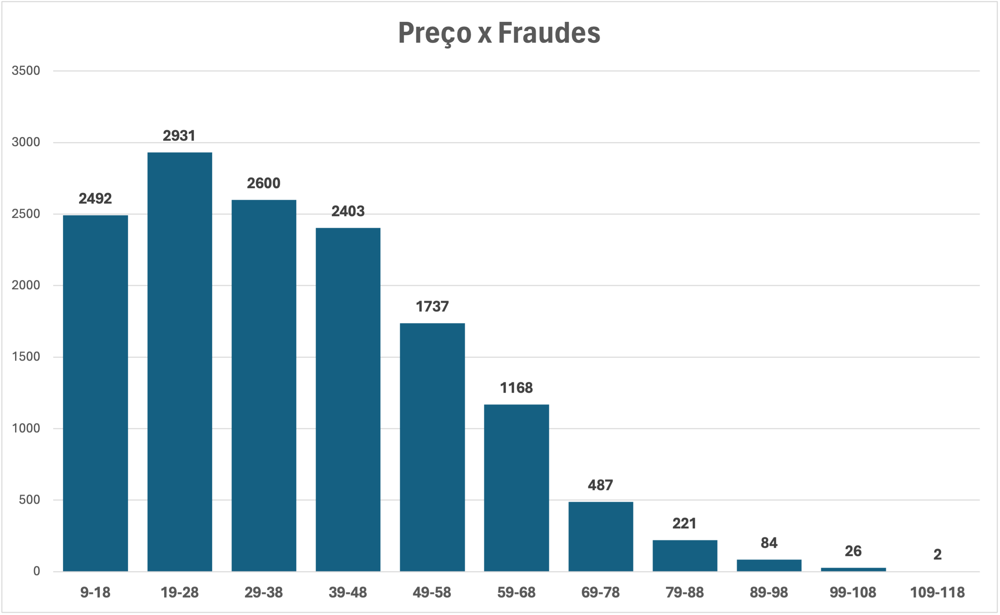

